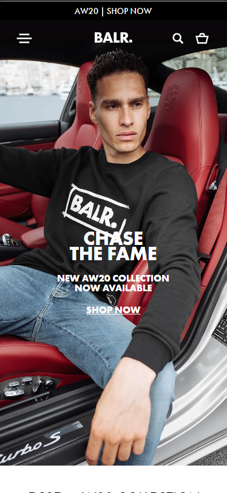
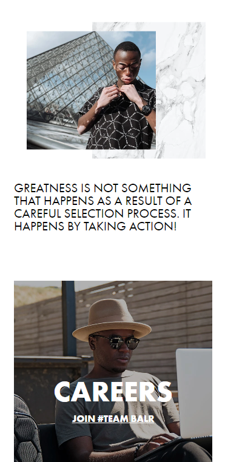

# Procesverslag
**Auteur:** First Wongsrila

## Bronnenlijst
1. https://tremont-demo.squarespace.com/
2. https://www.balr.com/
3. https://css-tricks.com/video-screencasts/150-hey-designers-know-one-thing-javascript-recommend/
4. https://www.w3schools.com/
5. https://developer.mozilla.org/en-US/
5. https://github.com/phomfirst/vak_frontend-development

## Eindgesprek (week 7/8)

Over het algemeen ging mijn project best goed. De meeste dingen die ik weilde maakten lukte. Er waren af en toe technische functies waar ik hulp moest zoeken of vragen. Ik ben blij met mijn eindresultaat. Wat ik de volgende keer beter wil doen is het sorteren van code en content. Ook wil betere namen geven voor classes, id's.

**Screenshot(s):**
#### Home pagina versie

#### About pagina versie

## Voortgang 3 (week 6)

### Agenda voor meeting

1. Hoe wijzig je de source van een video element aan de hand van de breedte van het scherm?
2. Hoe maak ik een simpele carousel?

### Stand van zaken
Deze week ben ik een ander website gaan maken. Ik vond de vorige website niet heel uitdagend en was best saai. Nu ga ik de website van Balr. maken. Hier zitten veel meer leuke elementen in met effecten. Ook is er meer content op de website te vinden.

## Voortgang 2 (week 5)

### Agenda voor meeting

1. Als je scrolt, hoe krijg je dat elementen effecten krijgen zoasl van links naar rechts of de opacity.
    Intersection Observer
2. Hoe krijg ik een paralax effect met met ipv een afbeelding, een section met content en buttons.
3. Verander de kleur van de navigatie-tekst als de achtergrond donker wordt.

## Voortgang 1 (week 3)

### Stand van zaken

Ik was bezig met het menu pagina. Ik wilde dit gaan stylen met flexbox. Al snel werd dit lastig op het ook responsive te maken omdat de website een 3 column grid had. Daarom begon ik research te doen naar "display: grid". Ook ging ik kijken hoe je met GRID een responsive website kan coderen/stylen. Uiteindelijk is het mij gelukt om de hele pagina de coderen die ook responsive is. Alleen de navigatie moet ik coderen. Ik moet nog iets meer onderzoek doen naar hoe je een responsive hamburger menu kan maken. Ook wil ik gaan kijken wat mijn alternatieven zijn voor de hamburger menu. 

**Screenshot(s):**
#### Desktop versie

#### Mobiele versie

#### Desktop Footer

#### Desktop Footer Paralax Effect

### Agenda voor meeting

1. Vragen hoe je een responsive website maakt
2. Technische vragen over hoe je een functie moet coderen/stylen.

### Verslag van meeting

Tijdens de meeting heb ik handige tips gekregen over de vragen die wij als groepje hadden. Ik heb ook tips en verbeterpunten gekregen over mijn code.

## Intake (week 1)

**Je startniveau:** Rood

**Je focus:** Responsive

**Je opdracht:** https://tremont-demo.squarespace.com/

**Screenshot(s):**

en

**Breakdown-schets(en):**

